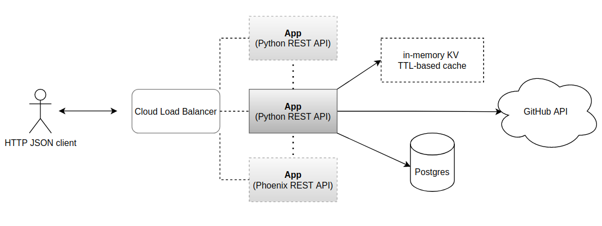

  <h1><code>github-searcher-py</code></h1>

  <strong>GitHub searcher API app in Python with FastAPI 🐍⚡</strong>

## Demo

This demo project has been deployed on Heroku. This is a high level diagram of this project:

## Development

To facilitate development, there's a [Makefile](./Makefile) with some frequently used commands.

#### Pre-requisites

Make sure you have installed these dependencies:

- docker
- docker-compose

Additionally, if you're going to contribute:

- `pre-commit install`
- `pip install requirements-dev.txt` to install pre-commit requirements
- This project was initially built with Python 3.8

### How to run

- `make compose-up`

### How to test

Once you have it running, to run both integration and unit tests:

- `make test`

#### Unit tests

- `make test-unit`

#### Integration tests

- `make test-integration`

### How to stop

- `make compose-down`
